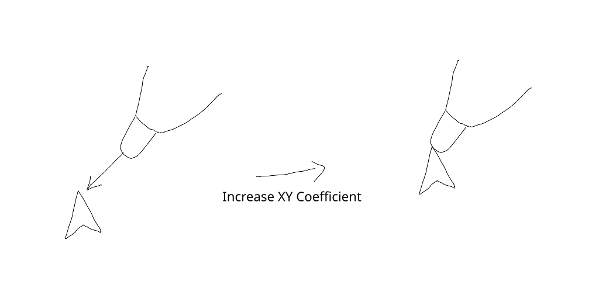

# Tilt-Calibration
An [opentabletdriver](https://github.com/OpenTabletDriver/OpenTabletDriver) plugin that calibrates the offset caused by pen tilt

## Explaination
The offset is calculated as below:
```
offset = X_sqr_coeff * tilt.X * Math.Abs(tilt.X)+ 
            X_coeff* tilt.X -
            XY_coeff* tilt.X * Math.Abs(tilt.Y),
            Y_sqr_coeff * tilt.Y * Math.Abs(tilt.Y) + 
            Y_coeff * tilt.Y-
            XY_coeff * tilt.Y * Math.Abs(tilt.X)
```
Where `X_sqr_coeff` is the `X^2 Coefficient`, `X_coeff` is the `X Coefficient`, and so on.
The `X Coefficient` mostly control the offset at low angle range, and the `X^2 Coefficient` mostly control the offset at high angle range.

The `XY Coefficient` decrease the offset at diagonal angle, the effect is shown as below:

